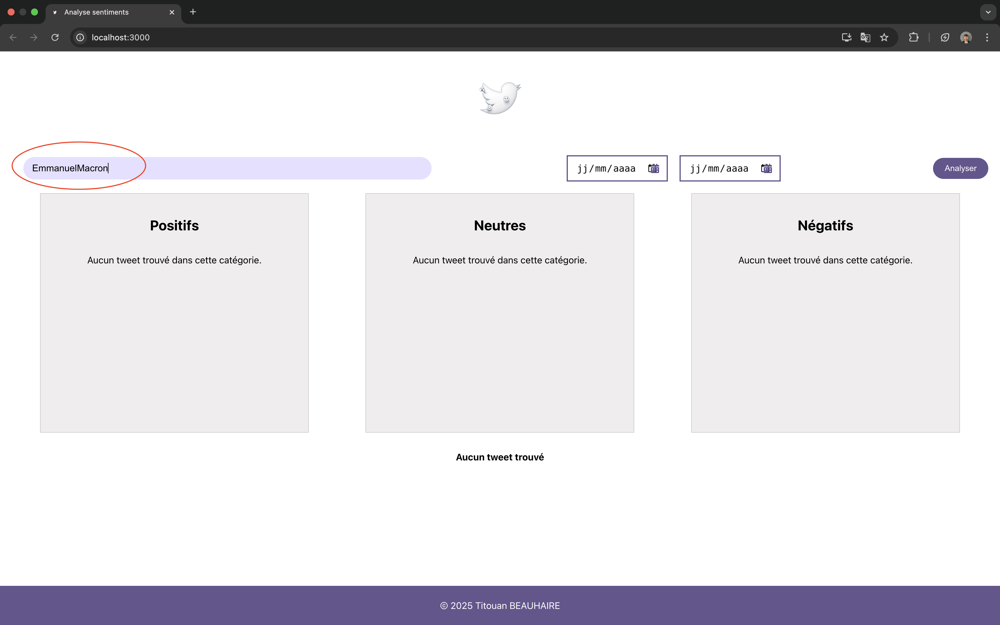
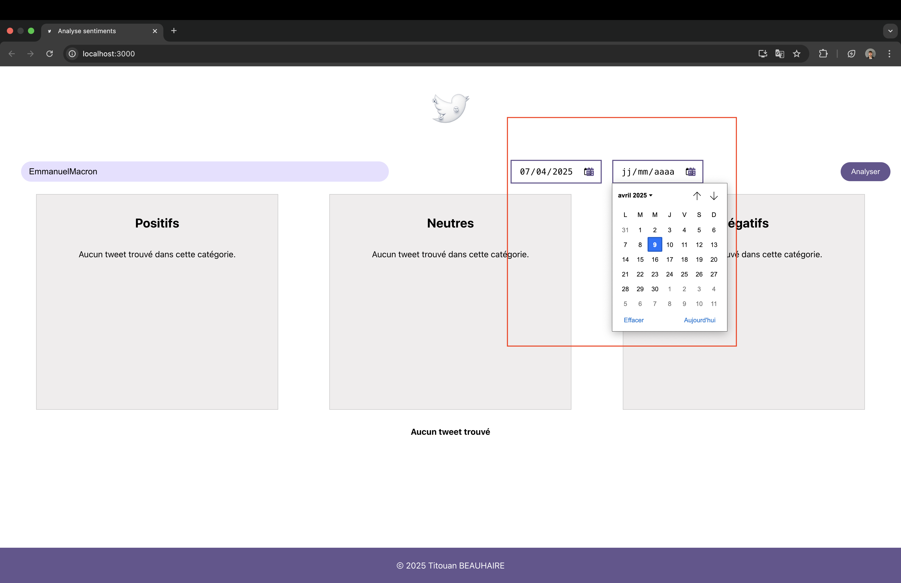
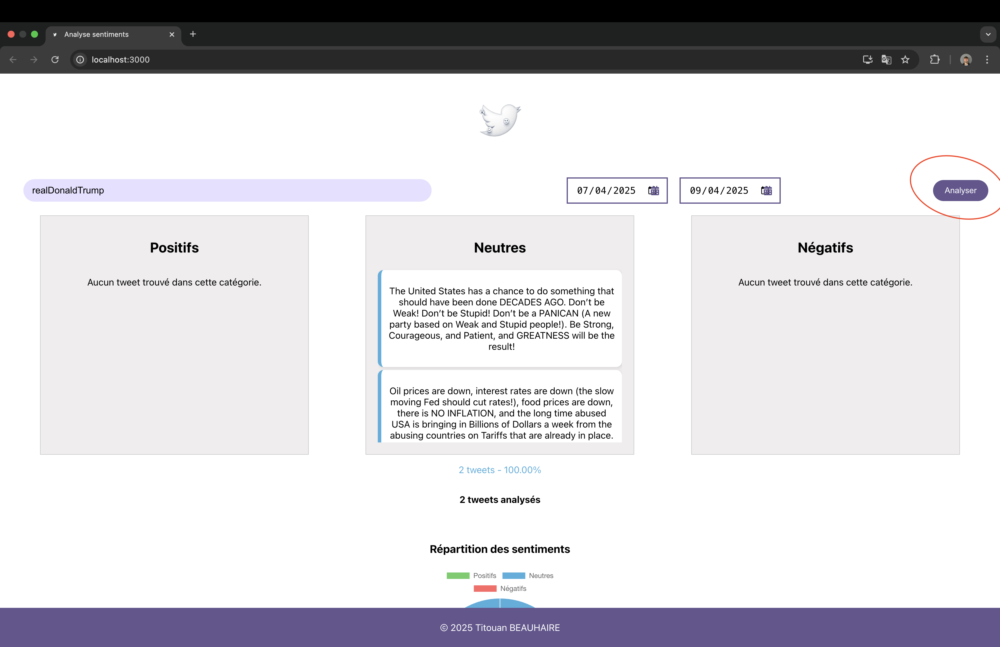
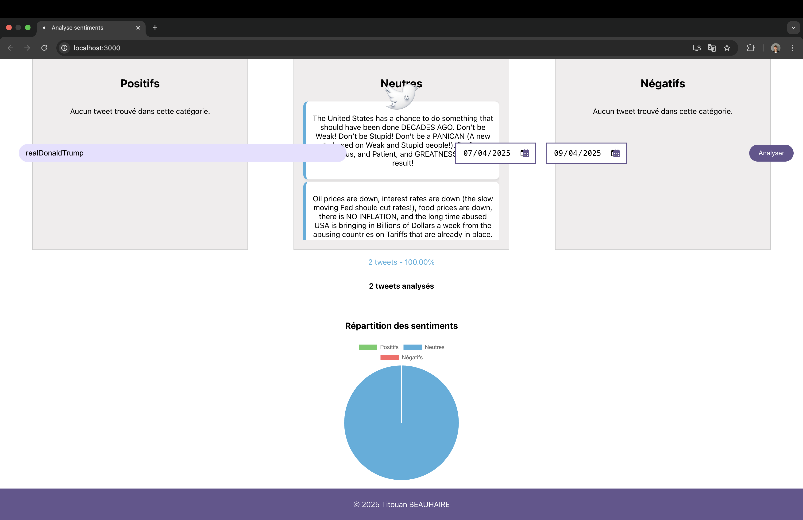

# Analyse Sentiment

Une application web permettant d'analyser le sentiment (positif, négatif, neutre) des tweets d'un utilisateur Twitter sur une période définie.


## Table des matières

- [Aperçu](#aperçu)
- [Fonctionnalités](#fonctionnalités)
- [Technologies utilisées](#technologies-utilisées)
- [Architecture](#architecture)
- [Installation](#installation)
- [Configuration](#configuration)
- [Utilisation](#utilisation)
- [API Reference](#api-reference)
- [Développement](#développement)
- [Licence](#licence)

## Aperçu

Analyse Sentiment est une application qui permet aux utilisateurs de rechercher un compte Twitter et d'analyser le sentiment des tweets publiés par ce compte sur une période spécifique. Les résultats sont présentés sous forme de liste de tweets avec leur classification de sentiment (positif, neutre, négatif) et un graphique circulaire visualisant la répartition des sentiments.

## Fonctionnalités

- Recherche d'utilisateurs Twitter par nom d'utilisateur
- Filtrage des tweets par période (dates de début et de fin)
- Analyse de sentiment automatique pour chaque tweet
- Visualisation des résultats via un graphique circulaire
- Calcul et affichage du nombre total de tweets analysés
- Affichage détaillé des tweets avec leur classification de sentiment

## Technologies utilisées

### Frontend


### Backend


### Outils & bibliothèques


## Architecture

L'application est structurée en deux parties principales:

### Backend (API)

Le serveur Express.js expose plusieurs endpoints:
- Récupération des données utilisateur Twitter
- Récupération des tweets d'un utilisateur
- Analyse du sentiment d'un texte via Hugging Face

### Frontend

L'interface utilisateur React comprend plusieurs composants:
- `App.js`: Composant principal qui gère l'état de l'application
- `SearchBar`: Pour la recherche d'utilisateurs Twitter
- `DatePicker`: Pour sélectionner la période d'analyse
- `TweetsSection`: Affichage et analyse des tweets
- `Total`: Affichage du nombre total de tweets analysés
- `PieChart`: Visualisation de la distribution des sentiments

## Installation

1. Clonez ce dépôt:
```bash
git clone https://github.com/beauhairetitouan/analyse-sentiment.git
cd analyse-sentiment
```

2. Installez les dépendances pour le backend dans un terminal:
```bash
cd server
npm install
```

3. Installez les dépendances pour le frontend dans un autre terminal:
```bash
cd analyse-sentiment
npm install
```

## Configuration

### Variables d'environnement

Créez un fichier `config/.env` dans le dossier du serveur avec les variables suivantes:

```
PORT=5001
TWITTER_BEARER_TOKEN=votre_token_twitter
HUGGINGFACE_API_KEY=votre_clé_api_huggingface
```

### Clés API requises

- **Twitter API v2**: Obtenez un Bearer Token depuis le [Portail Développeur Twitter](https://developer.twitter.com/en/portal/dashboard)
- **Hugging Face API**: Inscrivez-vous sur [Hugging Face](https://huggingface.co/) pour obtenir une clé API

## Utilisation

1. Démarrez le serveur backend:
```bash
cd server
npm start
```

2. Démarrez l'application frontend dans un autre terminal:
```bash
cd analyse-sentiment
npm start
```

3. Accédez à l'application dans votre navigateur à l'adresse `http://localhost:3000`

4. Entrez un nom d'utilisateur Twitter, sélectionnez les dates de début et de fin, puis cliquez sur "Analyser"

### Exemple

1. 


2. 


3. 





## API Reference

### Endpoints

#### `GET /api/test`
- Vérifie si l'API fonctionne correctement
- Retourne: `{ message: 'API is working!' }`

#### `GET /api/tweets/:query`
- Recherche des tweets par requête
- Paramètres:
  - `query`: La requête de recherche
- Retourne: Les 5 premiers résultats de tweets

#### `GET /api/twitter/user/:username`
- Récupère les informations d'un utilisateur Twitter
- Paramètres:
  - `username`: Le nom d'utilisateur Twitter (sans @)
- Retourne: Les détails de l'utilisateur

#### `GET /api/twitter/users/:id/tweets`
- Récupère les tweets d'un utilisateur sur une période donnée
- Paramètres:
  - `id`: L'ID de l'utilisateur Twitter
  - Query params:
    - `start_date`: Date de début (format YYYY-MM-DD)
    - `end_date`: Date de fin (format YYYY-MM-DD)
- Retourne: Liste des tweets avec ID, texte et date de création

#### `POST /api/sentiment`
- Analyse le sentiment d'un texte
- Corps de la requête: `{ text: "Le texte à analyser" }`
- Retourne: `{ sentiment: "positive"|"neutral"|"negative" }`

## Développement

### Structure des fichiers

```
analyse-sentiment/
├── public/
│   └── logo_tweet.png
├── src/
│   ├── components/
│   │   ├── DatePicker.js
│   │   ├── Percent.js
│   │   ├── PieChart.js
│   │   ├── SearchBar.js
│   │   ├── Total.js
│   │   ├── TweetCard.js
│   │   ├── TweetCategory.js
│   │   └── TweetsSection.js
│   ├── App.css
│   ├── App.js
│   └── index.js
├── server/
│   ├── config/
│   │   └── .env
│   ├── src/
│   │   ├── twitter.js
│   │   ├── index.js
│   └── package.json
├── .gitignore
├── README.md
└── package.json
```

## Licence

© 2025 Titouan BEAUHAIRE
